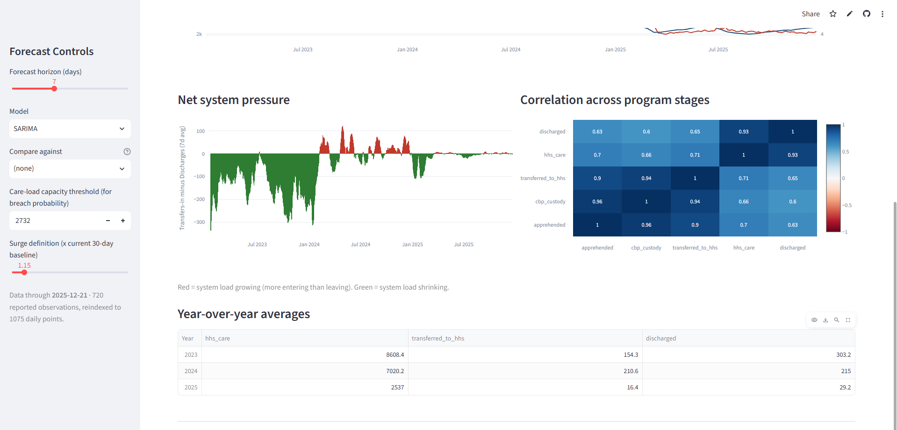
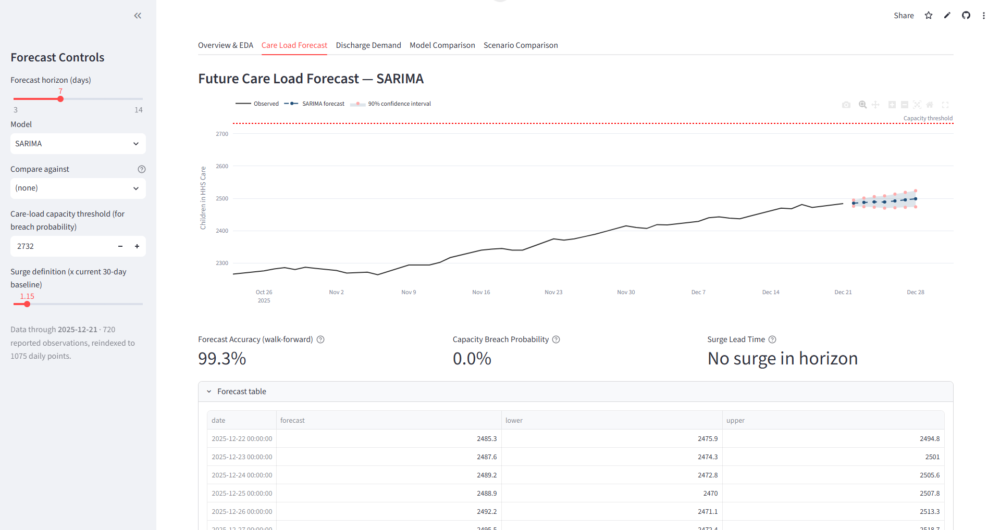
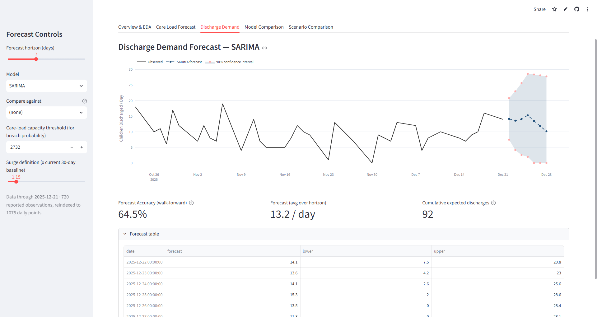
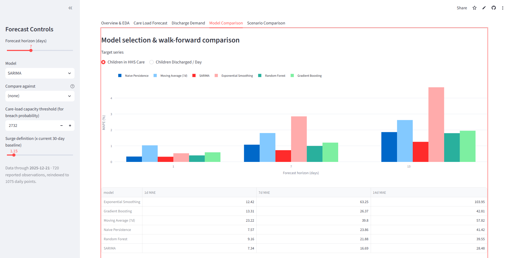
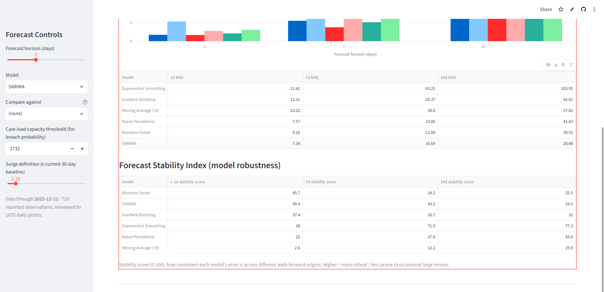
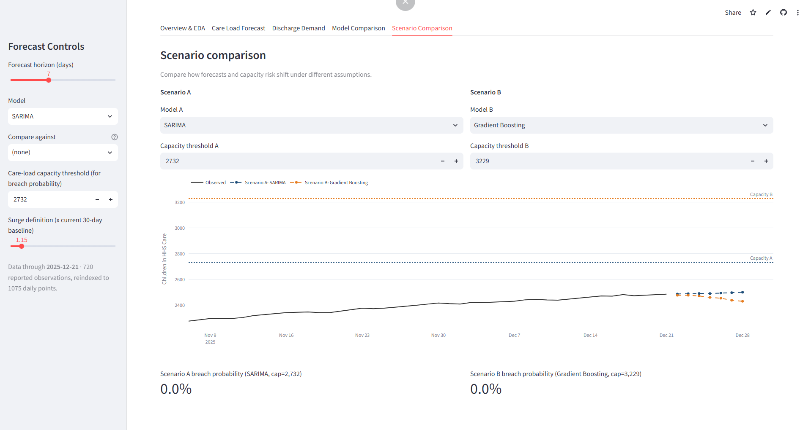

# 📈 UAC Care Load & Placement Demand Forecaster

A time-series forecasting system built using Python and Streamlit that predicts **how many children will be in HHS care and how many will be discharged over the next 1–14 days**, using statistical and machine-learning models trained on daily UAC Program operations data.

This project combines:

- 📊 Time-series EDA & structural-break detection
- 🤖 Statistical + machine-learning forecasting models
- 🧪 Strict walk-forward, multi-horizon model validation
- 📈 Interactive forecast dashboard with confidence intervals
- 🚨 Operational KPIs for capacity planning

---

## 🚀 Features

### 📌 Forecasting Models
The system benchmarks six forecasting algorithms across every prediction:

- Naive Persistence
- 7-Day Moving Average
- SARIMA(2,1,2)(1,0,1)[7]
- Holt-Winters Exponential Smoothing
- Random Forest Regressor
- Gradient Boosting Regressor

It also supports:

- ✅ Model-vs-model comparison (side by side)
- ✅ 90% confidence interval bands
- ✅ Recursive multi-step ML forecasting

---

## 🧮 Predictive Features Used

The application engineers the following features for both target series (Children in HHS Care and Children Discharged):

- Lag features (t-1, t-7, t-14)
- 7-day & 14-day rolling mean and standard deviation
- Net Pressure (Transfers into HHS care − Discharges) + its 7-day rolling mean
- Calendar effects: day of week, month, weekend indicator

---

## 🧪 Validation & Evaluation

The project includes a complete walk-forward validation pipeline:

### Validation Method
- Rolling-origin (walk-forward) time-based splits — never random sampling
- 10 evaluation origins, ~20 days apart, 500+ day minimum training window
- Multi-horizon scoring at 1, 7, and 14 days

### Metrics Computed
- MAE (Mean Absolute Error)
- RMSE (Root Mean Squared Error)
- MAPE (Mean Absolute Percentage Error)
- Forecast Stability Index (error consistency across origins)

### Operational KPIs
- Forecast Accuracy (%)
- Capacity Breach Probability
- Surge Lead Time
- Forecast Stability Index

---

## 🖥️ Dashboard Tabs

### 📊 Overview & EDA
- Care load & discharge trend chart
- Net system pressure chart
- Correlation heatmap across program stages
- Year-over-year averages table

### 🏠 Care Load Forecast / 🚪 Discharge Demand
Includes:
- Forecast chart with 90% confidence band
- Optional second-model overlay
- Forecast Accuracy, Capacity Breach Probability & Surge Lead Time cards
- Expandable raw forecast table

### 🧪 Model Comparison
- MAPE-by-horizon grouped bar chart
- MAE comparison table
- Forecast Stability Index table

### 🔀 Scenario Comparison
- Two independent model + capacity-threshold scenarios
- Side-by-side breach-probability comparison

---

## 📈 Visualizations

Interactive charts powered by Plotly:

- Dual-Axis Trend Chart (Care Load vs. Discharges)
- Net Pressure Bar Chart (color-coded by direction)
- Correlation Heatmap
- Walk-Forward MAPE Comparison Chart
- Forecast Chart with Confidence Interval Band
- Scenario Comparison Chart

---

## 🛠️ Technologies Used

### Programming Language
- Python

### Libraries & Frameworks
- Streamlit
- Pandas
- NumPy
- Scikit-learn
- Statsmodels
- Plotly
- SciPy

---

## 📂 Project Structure

```bash
├── app.py                 # Streamlit dashboard (main entry point)
├── data_prep.py            # Data loading, cleaning, feature engineering
├── forecasting.py          # Models + walk-forward evaluation + forecasting engine
├── kpis.py                 # KPI calculations (accuracy, breach prob, surge, stability)
├── requirements.txt
├── README.md
├── HHS_Unaccompanied_Alien_Children_Program.csv

```

---

## ⚙️ Installation

### 1️⃣ Clone the Repository

```bash
git clone https://github.com/Sheikh-13/Predictive_Forecasting_of_Care_Load_-_Placement_Demand.git
cd Predictive_Forecasting_of_Care_Load_-_Placement_Demand
```

---

### 2️⃣ Install Dependencies

```bash
pip install -r requirements.txt
```

---

### 3️⃣ Run the Application

```bash
streamlit run app.py
```

> ⏱️ First load trains and validates all 6 models (~30–60s). Every setting after that is served from cache and feels instant.

---

## 📦 Requirements

```txt
streamlit>=1.30
pandas>=2.0
numpy>=1.24
scikit-learn>=1.3
statsmodels>=0.14
plotly>=5.18
scipy>=1.11
```

---

## 📊 Forecasting Workflow

```text
Raw Daily Reports (CSV)
      ↓
Cleaning & Daily Reindexing (interpolation + is_reported flag)
      ↓
STL Decomposition (trend / seasonal / residual)
      ↓
Feature Engineering (lags, rolling stats, net pressure, calendar)
      ↓
Walk-Forward Validation (10 origins × 3 horizons × 6 models)
      ↓
Model Selection (lowest MAPE + highest stability)
      ↓
Future Forecast + Confidence Interval
      ↓
KPI Calculation (accuracy, breach risk, surge lead time)
      ↓
Dashboard Visualization
```

---

## 🎯 Forecast Output

The system predicts, for a selectable 3–14 day horizon:

- 📈 Children in HHS Care (daily point forecast)
- 📉 Children Discharged / Day

Along with:

- 90% confidence interval band
- Forecast accuracy (walk-forward validated)
- Capacity breach probability
- Surge lead time (days of advance warning)

---

## 📸 Snapshots

<div align="center">

### **Overview & EDA**
*Trend, net pressure & correlation view*




### **Care Load Forecast**
*Forecast chart with confidence interval & KPI cards — accuracy, breach probability, surge lead time*




### **Discharge Demand**
*Discharge forecast panel*



### **Model Comparison**
*Walk-forward MAPE comparison*



*Forecast Stability Index*



### **Scenario Comparison**
*Two-scenario breach-probability comparison*



</div>

---

## 📚 Educational Purpose

This project was developed as an internship/project work.

It demonstrates practical applications of:

- Time-Series Analysis
- Statistical & Machine-Learning Forecasting
- Walk-Forward Model Validation
- Operational KPI Design
- Interactive Dashboard Development

---

## ⚠️ Disclaimer

This project is developed for educational and research purposes only.

Forecasts are statistical estimates based on historical patterns and should complement, not replace, operational judgment. Capacity and surge thresholds used in this project are data-derived defaults, not official HHS figures — substitute real operational limits before using this tool for live decision-making.

---

## 👨‍💻 Author

Developed by **Sheikh Tauheed**

Internship Project -Data Science 

**LinkedIn**: [Sheikh Tauheed](https://www.linkedin.com/in/sheikh-tauheed-82100026a/)

**Github**: [Sheikh-13](https://github.com/Sheikh-13)

---

## ⭐ Future Improvements

- LSTM / deep-learning forecasting integration
- Shelter/region-level forecast breakdown (not just program-wide)
- Automated model retraining cadence
- Live data connector (replace static CSV with a refreshed feed)
- Configurable, HHS-confirmed capacity thresholds
- Deployment on cloud platforms
